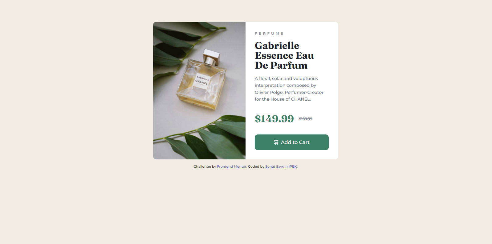

# Frontend Mentor - Product preview card component solution

This is a solution to the [Product preview card component challenge on Frontend Mentor](https://www.frontendmentor.io/challenges/product-preview-card-component-GO7UmttRfa). Frontend Mentor challenges help you improve your coding skills by building realistic projects. 

## Table of contents

- [Overview](#overview)
  - [The challenge](#the-challenge)
  - [Screenshot](#screenshot)
  - [Links](#links)
- [My process](#my-process)
  - [Built with](#built-with)
- [Author](#author)

## Overview

### Screenshot

### Links

- Solution URL: [Solution URL](https://www.frontendmentor.io/solutions/prewiev-card-component-using-css-grid-FJ0rxrThtR)
- Live Site URL: [Live site URL](https://frontend-mentor-challenges-nine-pi.vercel.app/)

## My process

### Built with

- Semantic HTML5 markup
- CSS custom properties
- Flexbox
- CSS Grid

## Author

- Website - [Sonat Saygın İPEK](https://www.sonatipek.com)
- Frontend Mentor - [@sonatipek](https://www.frontendmentor.io/profile/sonatipek)
- Twitter - [@sonatipek](https://www.twitter.com/sonatipek)
- LinkedIn - [Sonat Saygın İpek](https://www.linkedin.com/in/sonatipek)
